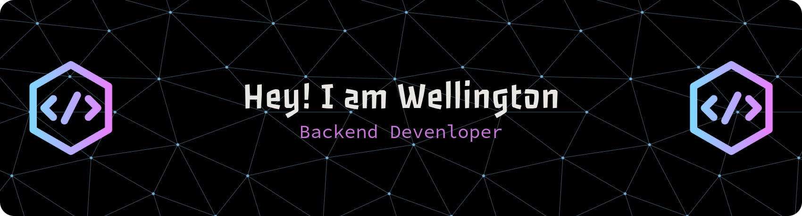

<!-- Banner -->

  

<h1 align="center">Olá 👋, sou Wellington</h1>
<h3 align="center">
  Estudante de Sistemas de Informação | Backend & SAP Enthusiast
</h3>

---

## 👨‍💻 Sobre mim  

Estudante de **Sistemas de Informação desde 2024/4**, sou apaixonado por **computação** e busco experiências que possam agregar à minha formação e me ajudar a crescer profissionalmente.  

Sou uma pessoa que **se esforça ao máximo** para alcançar meus objetivos e tenho **facilidade em aprender novas tecnologias**.  

---

## 🚀 Atualmente  

🎓 Cursando **Sistemas de Informação (Faculdade Antônio Meneghetti - AMF)**  
🌱 Buscando minha **primeira oportunidade** como **Desenvolvedor Backend** ou **Consultor SAP**  
💡 Interesse especial em **otimizar processos** e criar ferramentas que impactam positivamente o dia a dia das pessoas  
📌 Criador do **[ApoioBPO](https://github.com/Wellingtn/ApoioBPO)**, ERP utilizado por mais de **200 colaboradores**  

---

## 🎯 Atualmente aprendendo  

  
  
  

---

## 🌐 Conecte-se comigo  

  
  

---

## 🛠️ Tecnologias & Ferramentas  

  
  
  
  
  
  
  
  
  
  
  
  

---

## 📊 Estatísticas  

  
  

---

✨ Obrigado por visitar meu perfil! Explore meus projetos e vamos trocar ideias. 🚀

